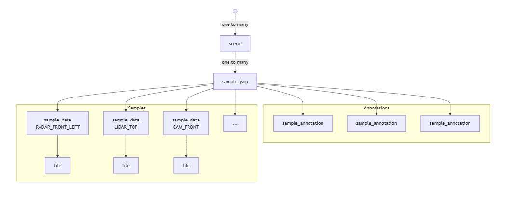
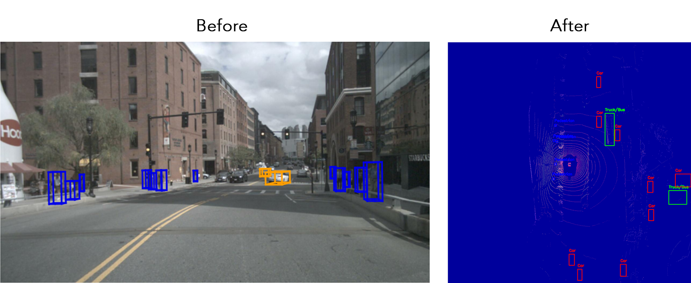
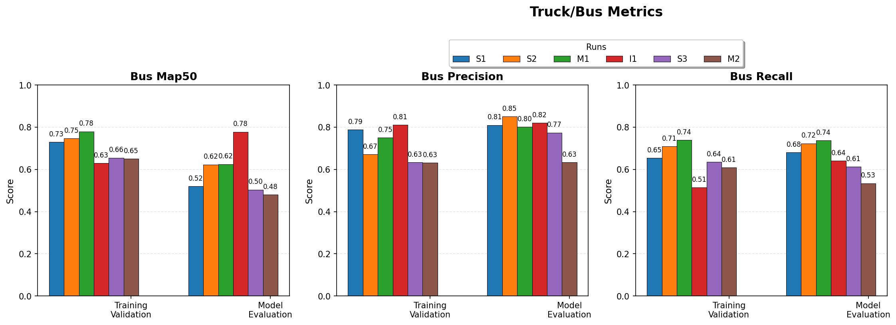
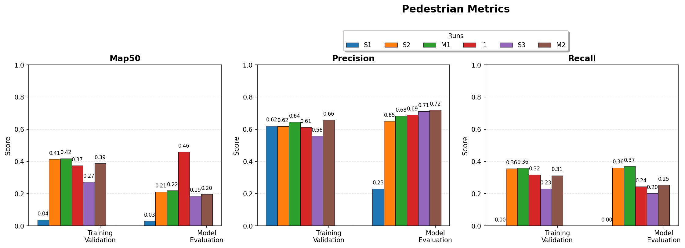
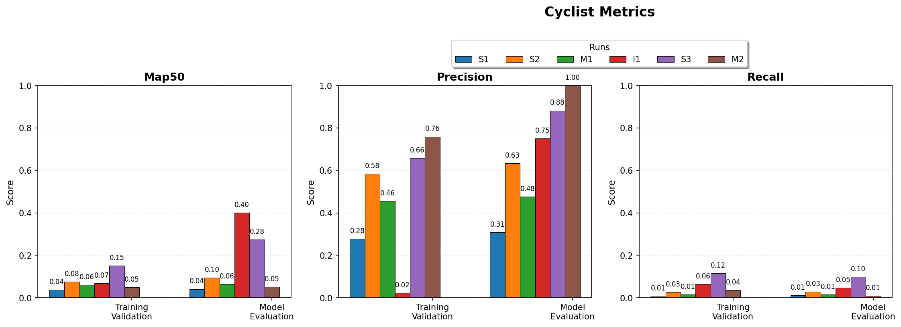
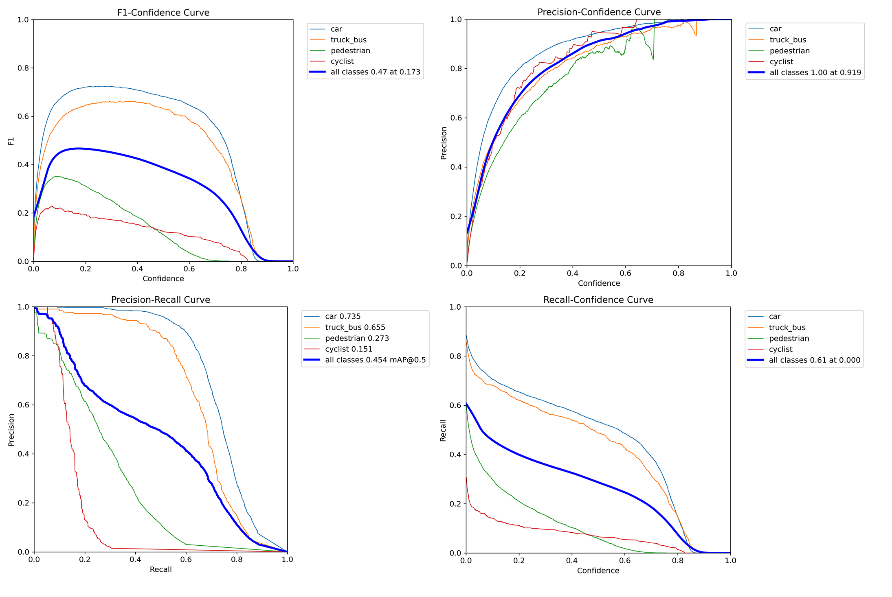
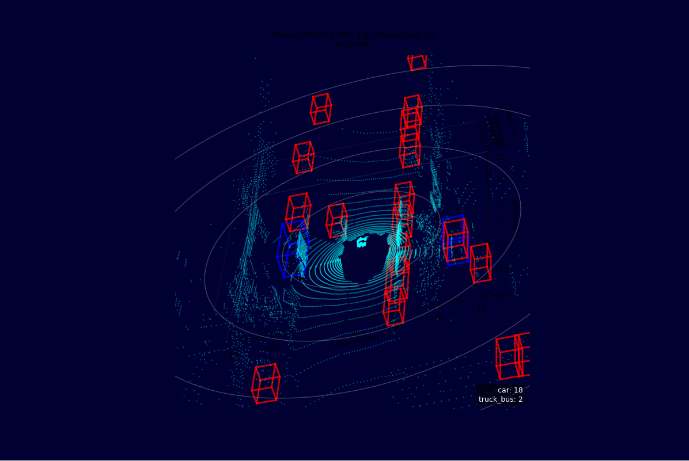

# Real-Time Object Detection Using LiDAR and Bird's-Eye View Representation

Object detection for self-driving cars is a important use case of using machine learning for computer vision. In this paper, we explore the topic by proposing a fine-tuned YOLOv12 model trained on Bird's-Eye View (BEV) rasterized LiDAR point clouds to detect vehicles, pedestrians, and cyclists.

Put intro here ...

## Data preprocessing

### Raw data

The raw data is a dataset provided by nuScenes, a computer vision company ...

The dataset is composed of 10 scenes, each scene is a 20 second driving sequence. Each scene is composed of 404 samples, each sample is a keyframe captured at 2 Hz. Each keyframe is accompanied by a snapshot from each of the 6 sensors on the car. In addition, each keyframe has a a set off annotations for the objects in the scene.

The format of the annotations is a JSON file, each annotation is a 3D bounding box with the following attributes: class, translation, size, rotation.

The schema of the data is illustrated in Figure 1:

### Preprocessing

We focused solely on the LiDAR data. In its raw form, LiDAR data presents as pcd.bin file which contains flat lists of points in the format [x, y, z, intensity] called a point cloud.

In order to make the LiDAR data suitable for a computer vision model, one popular technique is to convert the point cloud into a flat image that represents the scene from a top-down perspective called a Bird's-Eye View (BEV) image.

The LiDAR data contains no color information, so there would be no need to rely on color to detect objects, however it contains other features which uniquely identify objects such as height, intensity (surface reflectivity such as metal, clothing, etc), and density.

Therefore the 3 channels of the BEV image were repurposed to hold the height (maximum height of the points in the coordinate segment that the pixel occupies in 3D space), intensity (average intensity per pixel), and density (number of points per pixel) instead of the usual RGB values. The assumption being that YOLO models are able to converge on patterns uniquely associated with the objects regardless of what the channels represent.

The annotations also had to be translated from the 3D coordinates to the 2D coordinates of the BEV image. This was done by projecting the 3D bounding boxes to the 2D BEV plane as illustrated in Figure 2.

## Model selection and training

### Why YOLO

YOLO v12 was selected for its out-of-the-box performance and its ability to do transfer learning on non-conventional image data and on small datasets.

Expand...

### YOLOv12 architecture

Specifications...

### Transfer learning strategy

Stage 1 warmup followed by Stage 2 finetuning.

Hyperparameters? (learning rate, optimizer, dropouts, etc)

## Results

### Raw results

The following runs were conducted:

| Run | Resolution | Batch Size | Data Augmentation | Dataset Size | Data Leakage |
|-----|-----------|------------|-------------------|--------------|--------------|
| **S1** | 1000x1000 | 16 | original settings | 404 (v1.0-mini) | Yes |
| **S2** | 1240x1240 | 16 | original settings | 404 (v1.0-mini) | Yes |
| **M1** | 1000x1000 | 4 | modified settings | 404 (v1.0-mini) | Yes |
| **I1** | 1000x1000 | 16 | modified settings for phase 1, not phase 2 | 404 (v1.0-mini) | No |
| **S3** | original resolution | 16 | original settings | 3377 (v1.0-trainval) | No |
| **M2** | 1000x1000 | 4 | modified settings | 404 (v1.0-mini) | No |

The results are displayed in Figures 3-8.

**Overall metrics**

**Cars metrics**

**Truck/Bus metrics**

**Pedestrian metrics**

**Cyclist metrics**

### Detailed results S3

We took a closer look at the results from the S3 run which are displayed in Figure 9.

Discussion of the results ...

### Inference

In order to witness the model in action, we developed a simple visualizer which:

- Ran inference on chronologically ordered images from a scene
- Overlayed the bounding boxes on the images

Using this tool, we were able to visually confirm that the model's predictions was consistent with the LiDAR point cloud as illustrated in Figure 10.

### Conclusion

Write conclusion here ...

