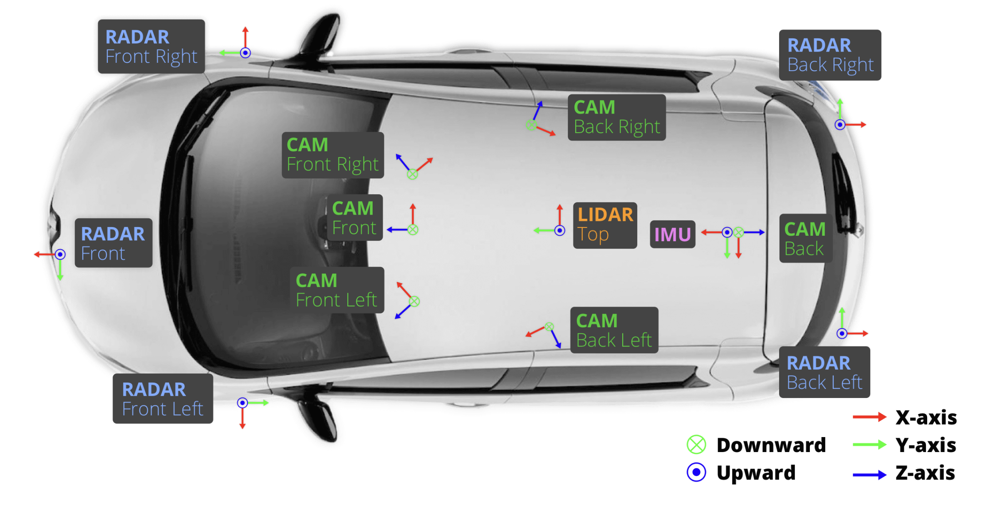
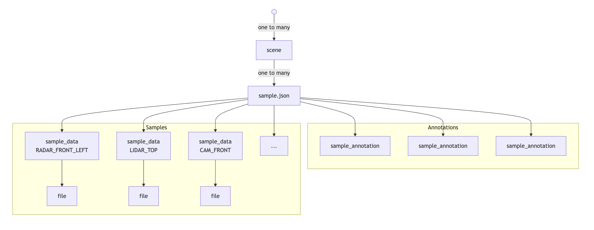
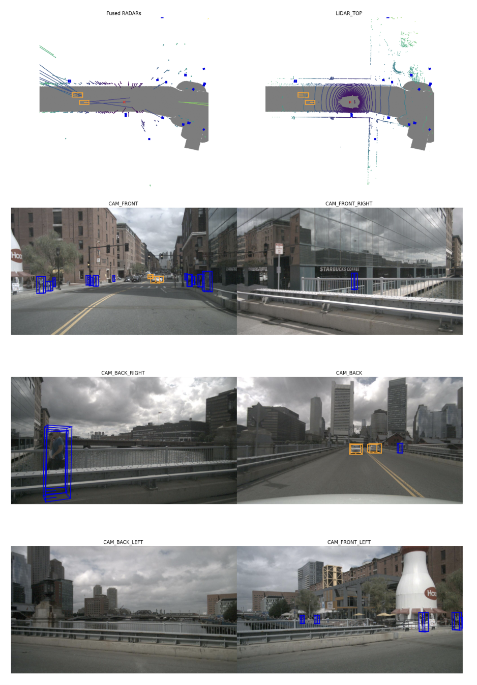
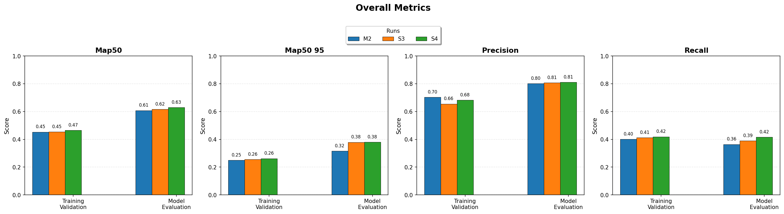
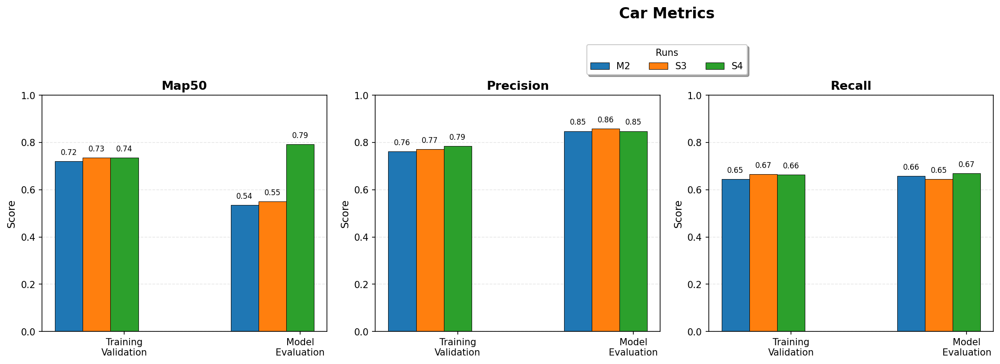
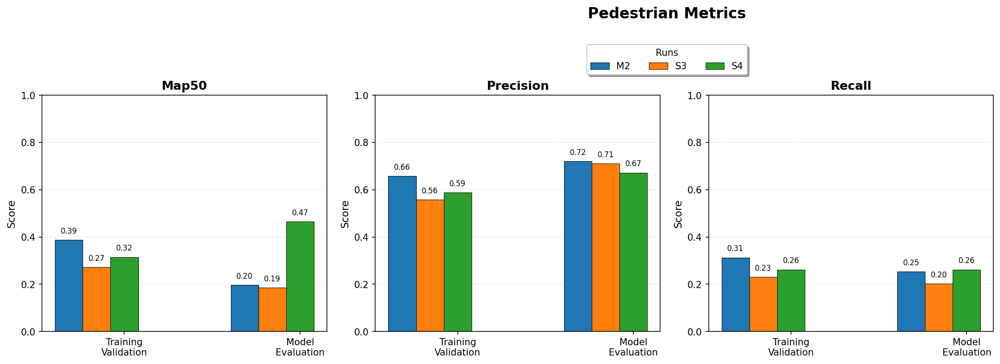
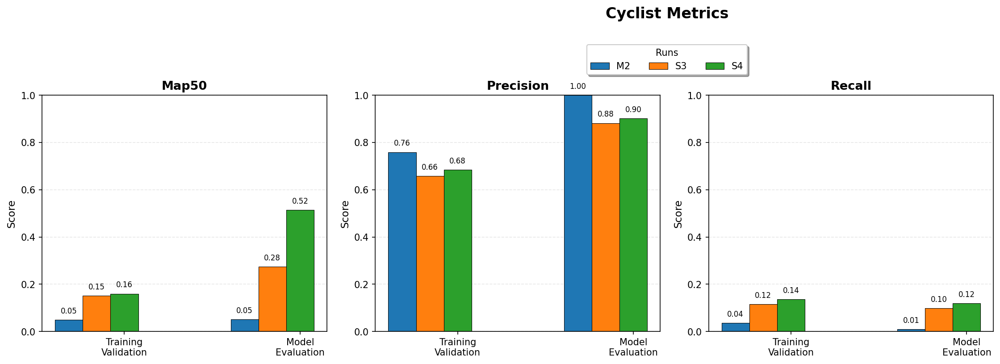
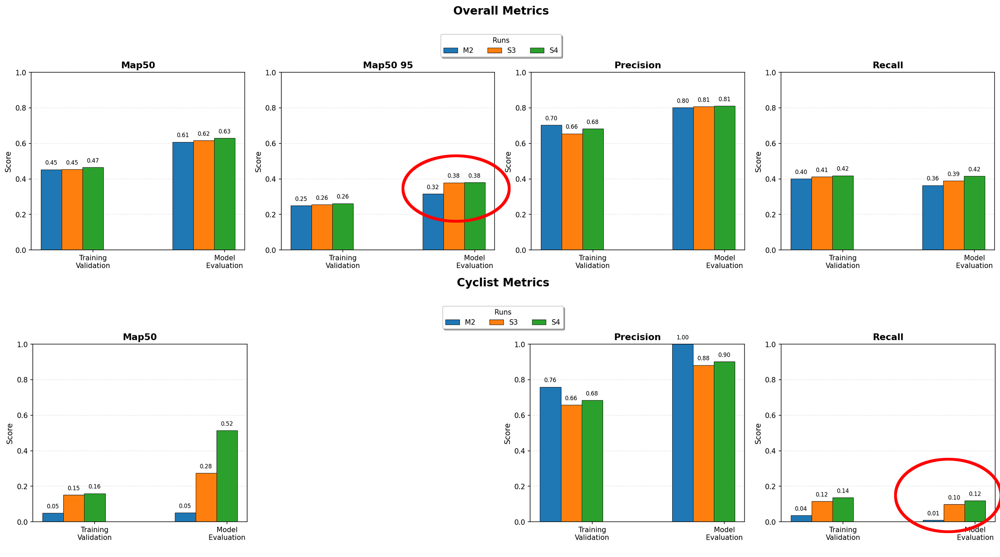

# Real-Time Object Detection Using LiDAR and Bird's-Eye View Representation

## Abstract

Autonomous vehicles require reliable real-time perception systems to detect surrounding objects under various environmental conditions, from clear skies to deep fog, rain, or snow. While camera-based detection systems are mature and efficient, they struggle in low-light or poor visibility conditions and lack inherent depth information. LiDAR sensors provide superior 3D spatial awareness and are designed to work well even with poor visibility conditions, but it comes with a cost: traditional 3D detection models are computationally intensive and difficult to deploy into a limited resources mobile environment. This project investigated a hybrid approach: converting 3D LiDAR point clouds into 2D Bird's-Eye View (BEV) images and training YOLOv12 for efficient object detection. Our goal was to demonstrate that this approach combines the best of both worlds: spatial accuracy of LiDAR with the computational efficiency of 2D detection architectures, achieving real-time performance suitable for a portable autonomous driving system.

## 1. Introduction

### 1.1 Motivation

In 1982 there was a famous TV show about a self-driving vehicle with artificial intelligence capable of talking, among other amazing features like video-calls or online wireless connectivity (before the Internet was even a thing). All these features were nothing but futuristic Science Fiction that seemed far away in an unreachable distant future.

Today is the future of that decade, and many of those features that captured our imagination are now a reality, like devices that can talk back to you, 24/7 wireless online connectivity, video calls, and of course: self-driving cars.

While only a few brands have offered fully autonomous vehicles out to the public, it's no longer fiction, but just a matter of time before the technology gets fully adopted. Before that happens, there are still challenges to solve.

Autonomous vehicles require real-time environment perception to detect and track surrounding objects accurately. The perception system must function reliably across varying lighting conditions, weather, and complex urban environments. Camera-based detectors, while computationally efficient, face limitations in poor lighting and lack direct depth information. 

LiDAR sensors overcome these limitations by providing accurate 3D measurements regardless of lighting conditions, as they work by sending short laser pulses of near-infrared light that can easily penetrate fog, snow, or rain, while being invisible to the human eye. After emitting the pulses, the LiDAR uses the speed of light by measuring the time it takes for them to bounce back in surrounding structures, then deducing the distance of such objects. 

However, processing 3D point clouds for object detection traditionally requires specialized architectures like PointPillars (Lang, A. H. et al., 2019) or CenterPoint (Yin, T. et al., 2021), that are computationally expensive and complex to train and present a challenge when trying to build an embedded system for a self-driving vehicle.

### 1.2 Problem Statement

Besides a high computing power requirement for real-time image processing, another challenge is depth: objects look smaller when they are further away, which might become a problem in object detection due to scale, as well as resolution limitations. This is why we have chosen Bird's-Eye View (BEV), an emulation of a perspective taken from above the autonomous vehicle (also known as the ego vehicle). From the BEV perspective, objects preserve their scale, making it easier for object-detection methods like YOLO, while lowering the computing power requirement.

This project addressed the following question: Can we apply the efficiency of mature 2D object detection models by converting LiDAR point clouds into Bird's-Eye View images, while maintaining the spatial accuracy advantages of LiDAR sensing?

### 1.3 Objectives

Our research objectives were:

1. Convert raw 3D LiDAR point clouds from the nuScenes dataset into 2D Bird's-Eye View (BEV) raster images
2. Transform 3D bounding box annotations into 2D YOLO-compatible format aligned with BEV representations
3. Train and validate a YOLOv12 model for LiDAR-based object detection on BEV images
4. Evaluate detection performance across multiple object classes (vehicles, pedestrians, cyclists)
5. Assess the feasibility of this approach for real-time autonomous driving applications

### 1.4 Contributions

We built the following features as part of our project:

- A complete pipeline for converting nuScenes 3D LiDAR data into YOLO-compatible 2D BEV format
- Implementation of coordinate transformation and axis-aligned bounding box computation for BEV projection
- A two-stage transfer learning methodology adapted from COCO-pretrained weights to LiDAR BEV domain
- A comprehensive evaluation demonstrating the feasibility of 2D detection models on LiDAR data

## 2. Literature Review

The history of Computer Vision for self-driving has been marked by breakthroughs in two key areas: the progress in object detection using deep neural networks such as YOLO and the publication of large-scale autonomous driving datasets.

One of the major impediments to autonomous driving was the slow inference time of early computer vision models such as R-CNN, which required multiple passes for every prediction. Because of the high frequency of changes in driving environments and the need for split-second decisions, the speed of inference was a critical operational constraint. This changed when Redmon et al. (2016) introduced YOLO, an object detection architecture capable of outputting box coordinates and class probabilities in a single pass. This unified approach enabled real-time detection at 45 FPS while maintaining competitive accuracy, establishing YOLO as a practical choice for deployment-oriented applications.

In addition to advances in object detection architectures, the trajectory of self-driving was reshaped by two major data-driven developments.

The KITTI dataset, proposed by Geiger et al. (2012), was the first large-scale real-world dataset with synchronized LiDAR, camera, and GPS samples. It formed the basis for the first set of unified self-driving benchmarks and evaluation metrics.

Subsequently, Caesar et al. (2020) released nuScenes,a large-scale autonomous driving dataset collected by Motional and nuTonomy. It contained samples from 1000 driving scenes with full 360° sensor coverage including LiDAR, RADAR, and six cameras. This dataset became a landmark in the industry and further solidified the performance metrics and evaluation goals used for self-driving perception models.

## 3. Dataset and Exploratory Analysis

### 3.1 nuScenes Dataset Overview

We used the nuScenes dataset. The dataset provides multi-sensor data including LiDAR, RADAR, cameras, GPS, and IMU, collected in Boston and Singapore under diverse driving conditions and over one thousand carefully planned driving scenes of about twenty seconds each.

Figure 1: This illustration shows the spatial placement and orientation of all major perception sensors: one top-mounted LiDAR providing 360° range measurements, six wide-angle cameras positioned around the vehicle for full visual coverage, five radar units for robust velocity and long-range sensing, and a centrally located Inertial Measurement Unit (IMU). Colored axes depict each sensor’s coordinate frame (X: red, Y: green, Z: blue) with up/down direction markers.

The resulting dataset came in two flavors, which are described in Table 1.

Table 1: Dataset Specifications:

| Dataset        | Source                | Scenes | Samples | Size   |
|----------------|----------------------|--------|---------|--------|
| v1.0-mini      | nuScenes official    | 10     | 404     | ~4 GB  |
| v1.0-trainval  | Kaggle (nuScenes mirror) | 850    | 3,377   | ~50 GB |

### 3.2 Dataset Structure

As illustrated in Figure 2, the nuScenes dataset is organized hierarchically with scenes as the top-level ojects. Each scene is a 20 second driving sequence and contains 20 samples captured at 2Hz (twice per second). Each sample contains one snapshot from each sensor on the car, including the LiDAR. In addition, each sample contains a series of annotations as class annotated bounding boxes.

Figure 2: Dataset schema of NuScenes dataset

### 3.3 Exploratory Data Analysis

We conducted comprehensive exploratory analysis to understand the data characteristics, as well as verifying the completeness and consistency of the data:

The point cloud files were composed of 30,000 to 40,000 points positioned in a 3D coordinate space which represents the surroundings of the vehicle. In addition to encoding positional information, they also encode height (values ranged from -3 to 5m) and intensity information (a measure of the reflectivity of the contact material). 

The per-class distribution of annotated objects was skewed, with ~50% of cars, 10% of trucks/buses, ~35% of pedestrians and ~5% of cyclists.

The dataset contained a wide variety of driving scenarios, including urban intersections with heavy traffic, highways with high-speed vehicles, parking lots with stationary objects and pedestrians, construction zones with unusual vehicle types and day and night scenes across different weather conditions.

### 3.4 Visualization Examples

We visually inspected the data at the sample level, at the sensor level, and at the annotation level (Figure 3).

Figure 3: Sample visualization

These visualizations confirmed the dataset's richness and the feasibility of BEV projection for object detection. We also confirmed the completeness of the data and visually checked the quality of the annotations across a few randomly selected scenes. 

## 4. Data Preprocessing

The preprocessing stage involved three major operations: converting point cloud data to 2D representation, converting annotations from 3D to 2D, and reducing the amount of classes from 23 to 4.

First, we trimmed the point clouds to within a 100m × 100m area around the vehicle using X-range [-50m, 50m] for forward/backward, Y-range [-50m, 50m] for left/right, and Z-range [-3m, 5m] for ground to elevated structures. This filtering reduced computational load by 50-70% while retaining all relevant objects for autonomous driving perception.

We then mapped the points in the point cloud to image pixels, repurposing the RGB channels to height, intensity, and density information to be used by the YOLO model.

We used a 0.09765625m per pixel resolution for the 1024 × 1024 images and a 0.078125m per pixel resolution for the 1280 × 1280 images. The mapping of each point was achieved using the formula:

$$u = \left\lfloor \frac{x - x_{\min}}{r} \right\rfloor, \quad v = H - 1 - \left\lfloor \frac{y - y_{\min}}{r} \right\rfloor$$

where $x_{\min}=y_{\min}=-50m$ and $r$ is the resolution.

The height channel (red) encoded maximum elevation at each pixel, normalized and gamma-corrected with power 0.5 to help distinguish vertical structures from the ground plane:

$$C_H(u, v) = 255 \cdot \left( \frac{\max_i(z_i) - z_{\min}}{z_{\max} - z_{\min}} \right)^{0.5}$$

The intensity channel (green) encoded average LiDAR reflectivity, capturing material properties that aided in distinguishing object types:
  
$$C_I(u, v) = 255 \cdot \frac{1}{n} \sum_{i=1}^{n} \text{intensity}_i$$

The density channel (blue) encoded point count per pixel using logarithmic compression, indicating measurement confidence and proximity:

$$C_D(u, v) = 255 \cdot \frac{\log(1 + n)}{\log(1 + n_{\max})}$$

where $n$ is the number of points at pixel $(u,v)$ and $n_{\max}$ is the maximum point count across all pixels. Figure 4 shows an example BEV image with all three channels.

Because the nuScenes dataset stores point clouds in the sensor coordinate space but annotations in global coordinates, we had to transpose the annotations using a two step process: from global coordinate space to ego vehicle coordinate space, then from ego vehicle coordinate space to sensor coordinate space.

The transformation formula applied was:

$$P_{sensor}=R^{T}_{sensor}\cdot(R^{T}_{ego}\cdot(P_{global}-t_{ego})-t_{sensor})$$

where $R$ and $t$ are rotation matrices and translation vectors from calibration data. Rotations are represented as quaternions $(q_w, q_x, q_y, q_z)$ and converted to rotation matrices.

Standard YOLO format does not support rotated boxes, so we computed axis-aligned bounding boxes (AABB) that fully contained the rotated 3D boxes. Given a 3D bounding box with center $(c_x, c_y, c_z)$, dimensions $(l, w, h)$, and yaw angle $\theta$, the 8 corners in sensor frame were computed using rotation matrix $R_z(\theta)$. The AABB in BEV was then:

$$x_{\min}^{\text{AABB}} = \min_i(x_i^{\text{corner}}), \quad x_{\max}^{\text{AABB}} = \max_i(x_i^{\text{corner}})$$

$$y_{\min}^{\text{AABB}} = \min_i(y_i^{\text{corner}}), \quad y_{\max}^{\text{AABB}} = \max_i(y_i^{\text{corner}})$$

The AABB coordinates were then normalized to YOLO format with all spatial values in [0, 1] relative to image dimensions:

$$x_c = \frac{(x_{\min}^{\text{AABB}} + x_{\max}^{\text{AABB}})/2 - x_{\min}}{W \cdot r}, \quad w = \frac{x_{\max}^{\text{AABB}} - x_{\min}^{\text{AABB}}}{W \cdot r}$$

$$y_c = 1 - \frac{(y_{\min}^{\text{AABB}} + y_{\max}^{\text{AABB}})/2 - y_{\min}}{H \cdot r}, \quad h = \frac{y_{\max}^{\text{AABB}} - y_{\min}^{\text{AABB}}}{H \cdot r}$$

Finally we consolidated nuScenes' 23 categories into 4 classes: cars (Class 0), trucks/buses (Class 1), pedestrians (Class 2), and cyclists (Class 3). This reduced class imbalance and focused on key autonomous driving objects.

As shown in Figure 4, the preprocessed images (center) show the point cloud data converted to BEV perspective and annotations are correctly positioned around the ego vehicle.

Figure 4: Preprocessed images with annotations and corresponding camera images.

## 5. Model Selection and Architecture

### 5.1 Model Architecture

We selected YOLO (You Only Look Once) for its real-time performance as a single-stage detector, its mature ecosystem with extensive testing on diverse 2D datasets, and the availability of pretrained COCO weights for transfer learning. 

We used YOLOv12s (small variant) with 9.1 million trainable parameters. The architecture consisted of a CSPDarknet backbone that extracts hierarchical features at multiple scales (pretrained on COCO's 80 RGB image classes), a Feature Pyramid Network neck that fuses multi-scale features through top-down and bottom-up pathways, and an anchor-free detection head that predicts bounding boxes and class probabilities at three detection scales. This allowed us to use a reliable tested model while retaining the flexibility to train and adapt it to this project's specific needs.

The model's loss function combines localization, objectness, and classification:

$$L_{total} = \lambda_{box} L_{box} + \lambda_{obj} L_{obj} + \lambda_{cls} L_{cls}$$

where $L_{box}$ is CIoU loss for bounding box regression, $L_{obj}$ is binary cross-entropy for objectness, and $L_{cls}$ is cross-entropy for class prediction. The Complete IoU (CIoU) loss is defined as:

$$L_{CIoU} = 1 - IoU + \frac{\rho^2(b, b^{gt})}{c^2} + \alpha v$$

where $\rho$ is Euclidean distance between box centers, $c$ is the diagonal of the smallest enclosing box, and $v$ measures aspect ratio consistency.

### 5.2 Transfer Learning Strategy

Pretrained COCO weights provided strong low-level features (edges, textures, shapes) but were trained on RGB images, not LiDAR BEV. We employed two-stage transfer learning to address this.

In Stage 1 (warm-up, 50 epochs), we froze the backbone and trained only the detection head with a learning rate of 0.01 to adapt the head to the BEV domain without disrupting pretrained features. In Stage 2 (fine-tuning, 150 epochs), we unfroze all layers and trained end-to-end with a learning rate of 0.001 to fine-tune the entire network for BEV-specific patterns. This staged approach prevented catastrophic forgetting while enabling domain adaptation.

### 5.3 Training Configuration

We trained with batch size 16, AdamW optimizer, cosine annealing learning rate schedule, and weight decay of 0.0005 at 1024×1024 image resolution. Data augmentation included rotation (±15°), translation (±10%), scale (±50%), horizontal flip (50% probability), mosaic augmentation combining 4 images (100% probability), and MixUp blending image pairs (10% probability). Early stopping with patience of 50 epochs was applied in Stage 2 only. Training required 2-4 hours per stage on a single GPU with approximately 12 GB memory usage.

## 6. Model Results

### 6.1 Evaluation Metrics

We evaluated our trained model using mAP@0.5, mAP@0.5:0.95, Precision and Recall. At the heart of these metrics is the assumption that differentiating between a true and false prediction is determined by the Intersection over Union (IoU) of the prediction with the ground truth:

$$\text{IoU} = \frac{|B_p \cap B_{gt}|}{|B_p \cup B_{gt}|}$$

where $B_p$ is the predicted bounding box and $B_{gt}$ is the ground truth box. 

Precision measures the proportion of correct detections among all predictions (TP / (TP + FP)), while recall measures the proportion of ground truth objects detected (TP / (TP + FN)).

Average Precision (AP) integrates precision across all recall levels:

$$\text{AP} = \int_0^1 p(r) \, dr \approx \sum_{k=1}^{n} (r_k - r_{k-1}) \cdot p(r_k)$$

where $p(r)$ is the precision at recall level $r$. mAP@0.5 is the mean AP across all classes at IoU threshold 0.5, while mAP@0.5:0.95 averages mAP across IoU thresholds from 0.5 to 0.95 in increments of 0.05:

$$\text{mAP@0.5:0.95} = \frac{1}{10} \sum_{t \in 0.5, 0.55, \ldots, 0.95} \text{mAP@}t$$

### 6.2 Overall Performance

We conducted training runs across both datasets with different configurations. Table 2 summarizes our results.

Table 2: Overall performance across runs

| Run | Dataset       | Resolution | mAP@0.5 | mAP@0.5:0.95 | Precision | Recall |
| --- | ------------- | ---------- | ------- | ------------ | --------- | ------ |
| 1   | v1.0-mini     | 1024×1024  | 0.608   | 0.316        | 0.801     | 0.364  |
| 2   | v1.0-trainval | 1024×1024  | 0.616   | 0.379        | 0.807     | 0.390  |
| 3   | v1.0-trainval | 1280×1280  | 0.630   | 0.380        | 0.811     | 0.416  |

The results indicated a steady increase in performance across all metrics, with the best model (Run 3) achieving mAP@0.5 of 0.630, mAP@0.5:0.95 of 0.380, precision of 0.811, and recall of 0.416 (Figure 5).

Figure 5: Overall performance metrics across runs

### 6.3 Per-Class Performance

Detection performance varied significantly across object classes, correlating with object size and LiDAR point density. Table 3 shows per-class metrics for the best run.

Table 3: Per-class performance (Run 3)

| Class      | mAP@0.5 | Precision | Recall |
| ---------- | ------- | --------- | ------ |
| Car        | 0.792   | 0.848     | 0.670  |
| Truck/Bus  | 0.750   | 0.820     | 0.612  |
| Pedestrian | 0.465   | 0.672     | 0.262  |
| Cyclist    | 0.515   | 0.902     | 0.120  |

Cars (~50% of instances) were the best-performing class with mAP@0.5 of 0.792. Their large size and high point density provide clear BEV signatures (Figure 6). 

Figure 6: Car detection performance across runs

Trucks/buses (~10% of instances) showed strong performance with mAP@0.5 of 0.750, aided by their large BEV footprint despite lower frequency (Figure 7).

Figure 7: Truck/Bus detection performance across runs

Pedestrians and cyclists proved more challenging due to their smaller LiDAR signatures, though high precision scores indicated that when the model did make a prediction, it was usually correct. 

Pedestrians (~35% of instances) had a recall of 0.262, meaning only one in four were detected (Figure 8). 

Cyclists (~5% of instances) were the most underrepresented class with the lowest recall at 0.120 (Figure 9).

Figure 8: Pedestrian detection performance across runs

Figure 9: Cyclist detection performance across runs

### 6.4 Training Parameter Comparison

To improve results for minority classes, we implemented two modifications: training on the larger trainval dataset (3,377 samples vs 404 for v1.0-mini) and increasing BEV image resolution from 1024×1024 to 1280×1280.

Increasing dataset size produced negligible improvements in mAP@0.5 and recall for most classes, but mAP@0.5:0.95 increased from 0.316 to 0.379, suggesting that larger amounts of data helped achieve tighter bounding box localization. Notably, cyclist recall jumped from 0.01 to 0.10.

Increasing resolution from 1024 to 1280 improved mAP@0.5 for all classes, indicating that the model was able to make more predictions overlapping at least 50% with ground truth. Cyclist recall further improved from 0.10 to 0.12 (Figure 10).

Figure 10: Performance comparison across training configurations

### 6.5 Qualitative Results

To witness the model in action, we developed a visualizer that reconstructed the 3D LiDAR scene  with model predictions overlaid on the point cloud data.

This visualization was generated from raw Ouster OS-1-128 PCAP files, which were decoded and converted into PCD format using the Ouster Sensor SDK. The reconstructed point cloud is displayed in full 3D, and YOLOv12 detection outputs are visualized as axis-aligned 3D bounding boxes over the predicted objects (Ouster, n.d.-a; Ouster, n.d.-b).

We observed that the model demonstrated strong detection of vehicles in open areas, accurate localization of stationary objects, and robust performance across varying point densities. Challenging cases included occluded pedestrians behind vehicles, cyclists at far distances with sparse points, closely spaced vehicles with merged BEV footprints, and objects at BEV boundaries with clipped bounding boxes.

Figure 11: Visualizer showing model predictions overlaid on BEV images

## 7. Discussion

### 7.1 Key Findings

In this project, we demonstrated the viability of a YOLO-based detection model on 2D BEV image representations of LiDAR data for autonomous driving applications. 

We found that the multi-channel BEV encoding (height, intensity, density) preserves sufficient spatial information for object detection while enabling efficient 2D processing. In addition we found that COCO-pretrained weights transferred effectively to the LiDAR BEV domain despite the different imaging modality, confirming that low-level features like edges and shapes generalize across domains. Finally, we found that detection accuracy correlated with object size and point density, with vehicles performing best and pedestrians most challenging. 

### 7.2 Limitations

Several limitations warrant discussion. BEV projection discards height information, making vertically stacked objects (such as an overpass with traffic below) ambiguous. Smaller objects like pedestrians and cyclists exhibited the lowest performance, requiring further research.

Standard YOLO uses axis-aligned boxes, so rotated vehicles had looser-fitting boxes that may incorrectly include background regions. Training on v1.0-mini (404 samples) limited generalization, and class imbalance affected minority classes. Far objects had few LiDAR returns, and pedestrians had inherently sparse representation, limiting detection range compared to camera-based methods.

### 7.3 Future Work

There are different areas of improvement:

First is collecting data, increasing the number of objects of the minority classes in the dataset. This can be done during data collection. If there is still an imbalance in real world data, then additional instances can be created using synthetic means.

Second is preprocessing techniques, one of these is increasing the resolution. Even though our resolution increase did not yield substantial improvements, it did show a trend towards improvement, therefore we posit that increasing it further will yield better results.

Third, the data augmentation parameters passed into the YOLO model during training could be tweaked more such as rotation, translation, scaling, flipping, mosaic and mixup.

Finally the hyperparameters of the training itself could be experimented with, such as learning rate, dropout, optimizer and loss function.

In addition, we recommend looking into increasing the feature space by injecting data from the other sensors into the BEV images, a process called multi-sensor fusion. This could be achieved for example with the camera images. This would involve calibrated geometric transformations to map the pixel information to the top-down BEV reference plane. Once that is done, the additional data could be piped in the model as additional layers at training and inference time.

## 8. Conclusion

This project demonstrates the feasibility of using YOLO-based 2D object detection on LiDAR data through Bird's-Eye View representation. By converting 3D point clouds into multi-channel 2D images, we achieved real-time detection performance while maintaining the spatial accuracy advantages of LiDAR sensing.

Our key contributions include a complete implementation pipeline from raw nuScenes data to trained YOLO model, a BEV encoding scheme with height, intensity, and density channels, a two-stage transfer learning methodology from COCO to LiDAR domain, and comprehensive evaluation demonstrating practical feasibility.

The results indicate that this hybrid approach offers a compelling trade-off: sacrificing some 3D spatial information for significant computational efficiency gains. For autonomous driving applications where real-time performance is critical, this approach provides a practical alternative to specialized 3D detection architectures. 

We're getting to experience first- hand many technological advancements that were only fiction decades ago, on our way to a safer world where most vehicles are autonomous. The best part is that will likely get to experience other benefits that weren't imagined even in that 1982 TV show: a world without DUIs, where traffic jams or accidents are a thing of the past, in which the pilot becomes another passenger and gets to enjoy the ride while the car drives into the sunset... and that world may be closer than you think.

## References

1. Redmon, J., Divvala, S., Girshick, R., & Farhadi, A. (2016). You only look once: Unified, real-time object detection. In *Proceedings of the IEEE/CVF Conference on Computer Vision and Pattern Recognition* (pp. 779-788).

2. Geiger, A., Lenz, P., & Urtasun, R. (2012). Are we ready for autonomous driving? The KITTI vision benchmark suite. In *Proceedings of the IEEE/CVF Conference on Computer Vision and Pattern Recognition* (pp. 3354-3361).

3. Caesar, H., Bankiti, V., Lang, A. H., Vora, S., Liong, V. E., Xu, Q., ... & Beijbom, O. (2020). nuScenes: A multimodal dataset for autonomous driving. In *Proceedings of the IEEE/CVF Conference on Computer Vision and Pattern Recognition* (pp. 11621-11631).

Ouster, Inc. (n.d.-a). OS1: Mid-range high-resolution lidar sensor. https://ouster.com/products/hardware/os1-lidar-sensor

Ouster, Inc. (n.d.-b). Ouster Sensor SDK documentation. https://static.ouster.dev/sdk-docs/index.html

4. Lang, A. H., Vora, S., Caesar, H., Zhou, L., Yang, J., & Beijbom, O. (2019). PointPillars: Fast encoders for object detection from point clouds. In *Proceedings of the IEEE/CVF Conference on Computer Vision and Pattern Recognition* (pp. 12697-12705).

5. Yin, T., Zhou, X., & Krahenbuhl, P. (2021). Center-based 3D object detection and tracking. In *Proceedings of the IEEE/CVF Conference on Computer Vision and Pattern Recognition* (pp. 11784-11793).

6. Lin, T. Y., Maire, M., Belongie, S., Hays, J., Perona, P., Ramanan, D., ... & Zitnick, C. L. (2014). Microsoft COCO: Common objects in context. In *European Conference on Computer Vision* (pp. 740-755). Springer.

7. Ultralytics. (2024). YOLOv12 Documentation. Retrieved from https://docs.ultralytics.com/models/yolo12/

## Appendix

Source code for this project is available at https://github.com/isralennon/MSAAI521
